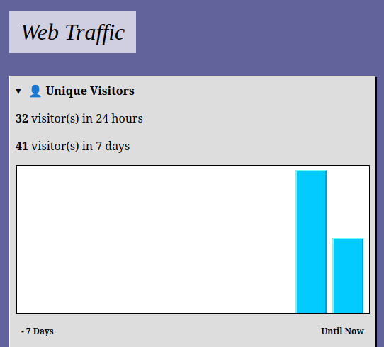

I've been in so many meeting where people will discuss a tiny point to death over the course of hours/days. For example,
at numerous companies there have been debates around time axis graphs and the current date. There's always someone who
thinks users will be confused that the visual for the current day is less than the previous days (because the day is in progress).
Additionally, the topic of timezones will come up. "Our data is in X timezone, but the user is in Y, the graph will be confusing".

I was reminded of this example as I built out a "daily visitors" graph for my analytics page. I chuckled as I just implemented a solution,
without hours of debate and Y salaries * Z hours of money wasted. 

My solution to the two problems was this:

1) Show visitor count as "X visitors in 24 hours". You're not commiting to a day in a timezone, instead it's relative by hours.
2) For the graph, use the wording "Until Now" to represent the partial nature of the value.
3) Give users some credit and know your audience.

Nothing is ever perfect and every UI will confuse someone, somewhere, somehow. The key is to see if there's a significant amount of
data indicating the UI is confusing, not to debate the tiny details to death before even releasing something.