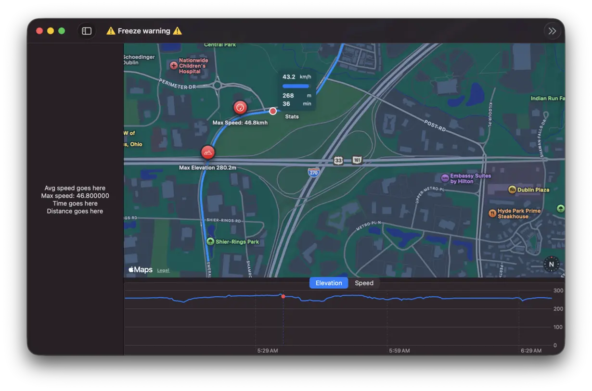

I've been playing around with a really fun experiment the past few days
using Swift. I don't have much experience with Mac OS development, but
have been very pleasantly surprised by Swift and Swift UI! There's so
much that can be accomplished out of the box that I haven't even looked
into third-party packages. It's also been really nice to take a step
away from web development (I'm working on
[htmlCMS](https://thatalexguy.dev/posts/html-cms-announcement/) as my
other project). No servers, auth, deployments, databases, CSS, etc. It's
so refreshing to have one way of doing it right, not a million.

For this Swift/Mac OS experiment, I've been building a parser for GPX
files. A GPX file is generated by a GPS as a log of coordinates for a
path. In cycling, this corresponds to your ride. The file can also
include metadata from sensors, such as speed, cadence, heart rate,
elevation and air temperature. I find this data fascinating and love
exploring my stats after a ride, but sadly the best way to do that on
the market, Strava, is undergoing some rapid enshittification, locking
stuff behind a pay, introducing A.I. and actively making the experience
worse. So I decided to build something for myself!

My goal is to display your route on the map, along with "events" marked
on the map. For example, instead of digging through charts you'll be
able to look at the map to review your ride and see markers for things
like "5% Grade Climb Start" -> "Zone 5 HR" -> "Climb Ended" -> "Max
Speed" -> "Zone 4 HR". These markers let you see how quickly you
achieved the climb, how much it stressed your body, and how far along
the route it took to recover. I'm finding this to be a lot more
effective than Strava's method of outlining information.

Here's a look at what I've accomplished in the past 2 days, more to come
soon!

